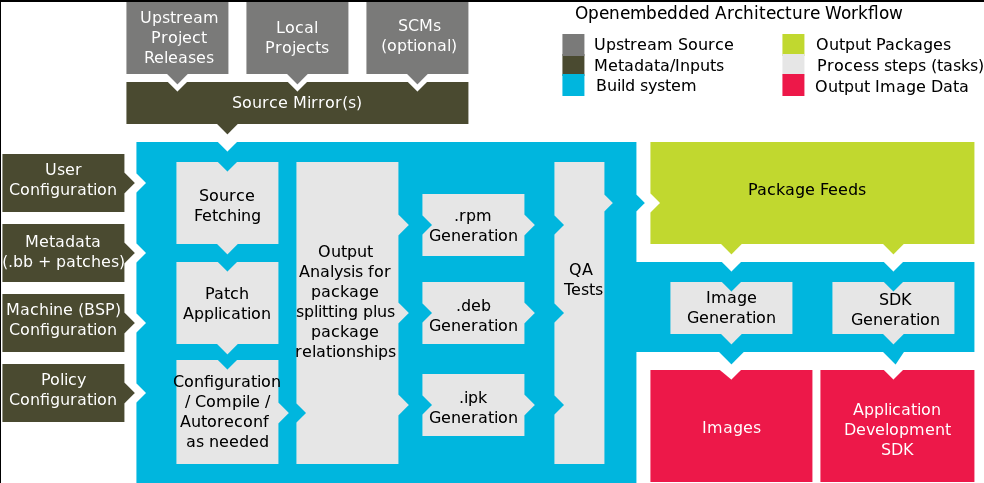

### Preliminary Steps
$ sudo apt install gawk wget git diffstat unzip texinfo gcc build-essential chrpath socat cpio python3 python3-pip python3-pexpect xz-utils debianutils iputils-ping python3-git python3-jinja2 python3-subunit zstd liblz4-tool file locales libacl1
$ sudo locale-gen en_US.UTF-8

### What is Yocto project
> it's a project or tool that many stackholders contribute in it to have a tool capable to generate linux distro

### Terminology in Yocto Project
> Yocto Project: Name of whole yocto project initiative
> Poky: Reference distro
> Bitbake: Build engine
> OpenEmbedded: [refrence distro + build engine] = Poky + Bitbake
> Metadata: Files to construct a linux system (configuration files)
> 1. Recipe (.bb): A file that describes how how to handle a software package.
> 2. Class: (.bbclass): Generalization of actions taken in recipes
> 3. Append file (.bbappend): File that overwrites a recipe
> 4. Include file (.inc): Recipe include file
> 5. Configuration (.conf): System, layer, machine configuration file
> Layer: Collection of metadata

### Roughly what are the tasks that take place to have an package?
> Fetch: fetch sources
> Decompress: decompress if there is archives
> Patch: apply patches
> Configure: Configure project build to have GNU Makefile
> Compile: compile project sources
> install: install binaries into specific dir
> Deploy & Package(rpm, ipk, deb)
> Q/A: ensure the package is healthy.

### Yocto project architecture?

### How to setup your yocto build project?
> 1. clone poky: git:/git.yoctoproject.org/poky

### How to build a minimal image for Qemu?
> 1. go to poky and run: $ . oe-init-build-env
> 2. run $ bitbake dropbear

### List the three main layers that should be existed to have an image?
> meta  
> meta-poky  
> meta-yocto-bsp  

### List the bold stages of the image generation process?
> 1. Download the sources (i.e. openssl, qt5)  
> 2. each package has its recipe to depict the steps of the (configuration, compilation, installation, archive)  
> 3. then the package output would be created  
> 4. to create an image, it would be composed of some/all generated packages based upon the image recipe
> 5. image file is generated

### List the important files in the generated build/conf directory?
> After running the script oe-init-buil-env the follwoing files gets generated  
> bblayers.conf: contains the essintial layers for an image  
> local.conf: contains some important global variables for the board configuration (i.e. MACHINE)  
> build/tmp/log/cooker/consol.log: this file contains the last build consol output  
> work directory: each recipe or package has its own directory, and each directory shall be considered as sysroot (I mean it has it folder structure besides it contains sysroot inside), and IMPORTANT to know that the log-logs and run-logs:
>> log.task_ordere: shows the order of the tasks that has run.
>> log.do_patch: log of the patching task
>> log.do_compile: log of the compilation
>> run.do_compile: list the executed python and bash commands used in the compile task

@@@ TODO @@@
Editor setup install packges:
code runner extension
open in default browser
yocto project bitbake (cpu consuming)!

### What does the MACHINE variable denotes to?
1. the machine/board configuration

### How to assign the value of MACHINE variable?
1. check any layer (preferrably the silicon provider bsp layer) and check the conf directory then the machine directory, over there there would be all config files that this provider supports for its boards, choose the suitable one. to choose the board, you can simple extract it from the file name and you can assign the file name to the variable.