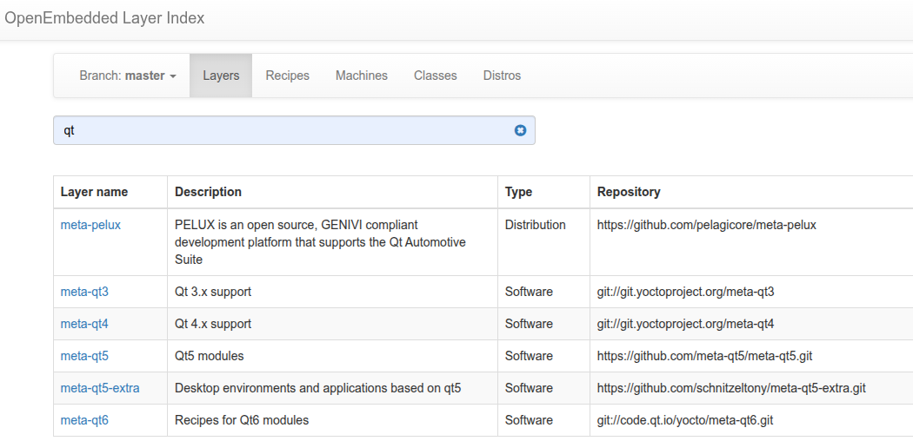

### Q0. How to clone a layer supported by the comunity?
> via OpenEmbedded layer index forum "https://layers.openembedded.org/layerindex/branch/master/layers/"  
> git clone <layer_name> -b <branch_name>
### Q1. Why Layers?
> The layer concept in Yocto is crucial for maintaining a clean, customizable, and scalable embedded Linux build system. By using layers, you can manage complexity, share configurations, and ensure that your system is flexible for multiple hardware platforms and software packages.  
> also we can say many recipes were developed by the community and I want to reuse it, so I have to use the layer the composes this recipe.  

### Q2. How to know the layers direcories?
> the start with meta* prefix

### what is the purpose of Append to recipes files .bblayer
> specify additional steps, or extend some task like do_compile and do_install ..etc.
> ex: the order of executing the do_compile if it has been extended/appended from many layers, the do_compile in the very low layer start executing then the upperlayer until the most uppper layer do_compile:append. (note: no overwrite, just append)  
> note: keep in the upper layer, the same lawer layer structure of the path of the recipe-file

### How does a layer would look like?
> [Append to recipes - Classes - Recipe(s) - Machine(s) - Distro(s)]
> Append to recipes .bbappend: Overwrites the variables and functions that are descriped in other layers.  
> Classes .bbclass: Reuse common steps with various tasks.   
> Recipe(s) .bb: Descipes the stages of the package generation.  
> Machine(s) .conf: Descripes what machine we will be used, the uboot/kernel args, cross-compiler options and flags.  
> Distro(s) .conf: Descripes linux distro related settings.  

### How to add a layer into the build system?
> Extend the global variable **BBLAYERS** with the layer path where located at build/conf/bblayers.conf

### Show layers category?
> OpenEmbedded Core Metadata (oe-core) - The lowest Priority  
> Yocto Layer Metadata (meta-yocto)  
> Hardware specific BSP (i.e nxp)  
> UI - Optional Layer (i.e. xfc, nome)  
> Commercial Layer (i.e. qt)  
> Developers-Specific Layer (i.e application) - The highest Priority  
> Remark: We modify our own layers only (Developers-Specific Layer), this is a good practice.

### How to get a recipe implemented by the community?
> openembedded layer index
> github
> example: git clone https://github.com/meta-qt5/meta-qt5.git -b kirkstone

### what is layer dependancy?
> normaly a layer dependes on other layers, and such dependancy is listed i.e /meta-qt5/conf/layer.conf
> check the variable **LAYERDEPENDS_qt5-layer = "core openembedded-layer"**, states that this layer depends on meta-layer and oe-layer, so I have to clone openembedded-layer myself as it's not existed yet in the pocy distro.  
> openembedded-layer: it's a layer group.

### How to write a layer from scratch?
> 1. Use the provided script by poky.
> 2. Copy old layer and adapt it to your implementation.

### What is essential to be found in any layer?
> to find a file under {layer-name}/conf/layer.conf
> this file is responsible is being read by OpenEmbedded to interpret it.

### Define the essential variables in the layer.conf file?
> BBPATH => stores the path of the layer to be passed to bitbake
> BBFILES => descripes where bitbake should look for recipes either .bb or .bbappend
> BBFILE_COLLECTIONS => define the name of the layer
> BBFILE_PATTERN_<layer_name> : BitBake must attach .bbappend to an existing recipe in some other layer. To avoid chaos, BitBake keeps track of which layer provided the append.
> BBFILE_PRIORITY_<layer_name> : define the layer priority, the greater the value the higher the priority.
> LAYERSERIES_COMPAT_<layer_name> : contains the yocto-layer branches that our layer compatible with.
> LAYERDEPENDS_<layer_name> : contains the dependancy layers
### What are dynamic layers and dynamic variables BBFILES_DYNAMIC?
> allow us to make modifications on other layers without changing their content.

| Aspect            | Static Recipe (`.bb`)                          | Dynamic / Append (`.bbappend`)                               |
| ----------------- | ---------------------------------------------- | ------------------------------------------------------------ |
| Purpose           | Full recipe definition                         | Modify/extend existing recipe                                |
| Overwrite         | Replaces recipe entirely (subject to priority) | Merges with recipe; can override some variables/tasks        |
| Layer interaction | Only one recipe “wins”                         | Multiple `.bbappend` files can contribute together           |
| Use case          | Replacing a recipe with your own version       | Customizing a recipe from another layer without replacing it |

### Why should we have meta-ti as long as meta-yocto-bsp contains our SoC configuration?
> 1. meta-yocto-bsp:  
> Provides "reference: BSPs for each of the supported architectures one for Arm (BeagleBone Black), one for MIPS, PPC and x86. it's based on the mainline kernel/bootloader. it doesn't support any advanced features or anything not in the upstream mainline kernel, e.e. no capes, no power management no hardware acceleration, no 3D, no PRU, etc. The purpose of this BSP is to have some basic out-of-box experience for the select hardware within poky to evaluate the YOCTO Project and OpenEmbedded framework, but not the specific harware platforms.  
> 2. meta-ti:  
> Official Texas Instruments BSP that provides the latest WIP "staging" kernel and bootloader most of the advanced features and peripjeral support for the wider range of latest TI platforms.

### How to list all the included layers by commands?
> bitbake-layers show-layers

### How to add a layer by command?
> bitbake-layers add-layer <meta-layer-path>

### How to build a minimal image?
> bitbake core-image-minimal

### How to check the packages the should be installed for your image?
> run $ bitbake -g core_image_minimal

### How to enable ssh?
> IMAGE_FEATURES:append " ssh-server-dropbear "
### How to enable UART consol?
> SERIAL_CONSOLES = "115200;ttyO0" (already defined in meta-ti-bsp)

### What are the options to change the variables of local.conf?
> 1. change it in the same file  
> 2. change it in your own layer

### Are all packages being installed in the image?
> some times a package requires dependencies, so its dependencies would be downloaded and to be able to compile the requried package, and this package only shall be installed in the image without all the dependencies.

